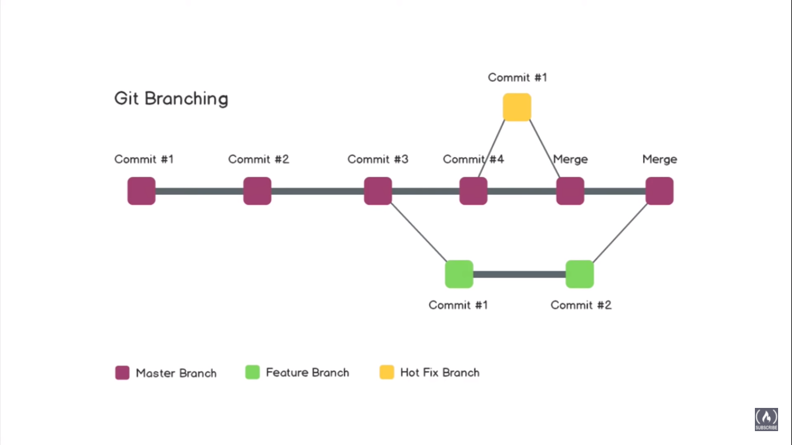

# Learning GIT

[GIT documentation](https://www.atlassian.com/git/tutorials)

**Table of Contents**
1. What is git and github?
    1. Basic commands of git
1. Branching
    1. Merging branches
    1. Branching conflicts
1. add commands
1. Stash commands

---

## What is git and  github?

Git is a open source version control system. you interact with git using a terminal like git bash, command line.
Github is a website to host your repositories online.

### git installation

git install: 'http://git-scm.com/download/win'

> Your mind is programmable. If you're not programming someone else will program it for you.
>
> -- <cite>Unknown</cite>

## Branching
A branch is a version of the repository that diverges from the main working project.
Two things to consider in branching are:

 - Merging branches
 - Branching conflicts

## add command
| command |syntax |
| ---:--- | ---:--- |
| 1| git add -A|
|2|git add -u|
|3|git add .|

## stash command

        
Stash Commands

        git stash save "Worked on add function"
        git stash apply stash@{0} 
        git stash list
        git stash pop
        git stash drop stash@{0}

